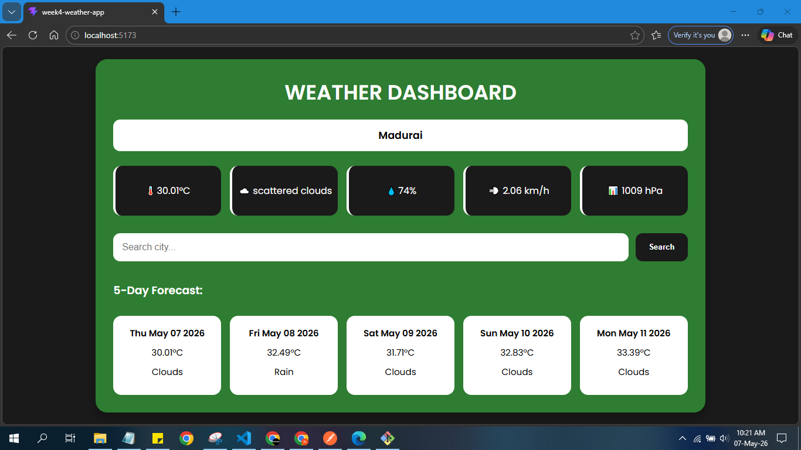

# Weather Dashboard App

A modern and responsive Weather Dashboard built using React.js, Axios, Context API, and OpenWeather API.

---

# Live App

[Weather Dashboard App](https://week4-weather-app.vercel.app/)

---

## Screenshots



---

## Features

- Search weather by city
- Current temperature display
- Weather conditions
- Humidity information
- Wind speed
- Atmospheric pressure
- 5-Day weather forecast
- Local storage support
- Fast API fetching with Axios
- Fully responsive UI
- Responsive Design

---

## Technologies Used

- React.js
- Context API
- Axios
- OpenWeather API
- CSS3
- Vite

---

## Installation

Clone the repository:

```bash
git clone YOUR_GITHUB_REPO_LINK
```

Open project folder:

```bash
cd week4-weather-app
```

Install dependencies:

```bash
npm install
```

Start development server:

```bash
npm run dev
```

---

## Environment Variables

Create a `.env` file in the root folder:

```env
VITE_API_KEY=YOUR_OPENWEATHER_API_KEY
```

---

## API Used

### Current Weather API

```bash
https://api.openweathermap.org/data/2.5/weather
```

### Forecast API

```bash
https://api.openweathermap.org/data/2.5/forecast
```

---

## Learning Concepts

This project helped practice:

- React Components
- Props & State
- Context API
- REST API Integration
- Axios Requests
- Async/Await
- Responsive CSS
- Local Storage

---

## Future Improvements

- Dark/Light mode
- Current location weather
- Weather icons
- Loading spinner
- Better error handling

---

## Author

Naveenraj

---

## Support

If you like this project, give it a ⭐ on GitHub.